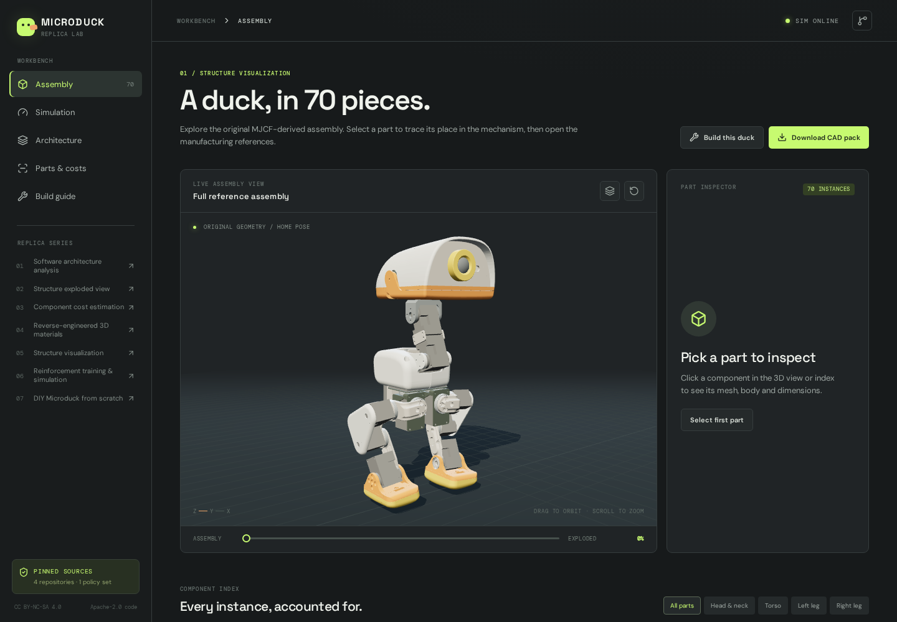

# Microduck Replica Lab

Explore Microduck’s assembly, rehearse its published walking policy, and plan a physical replica with reference CAD, build instructions, and US/China sourcing guides.

An independent community project inspired by [yishan / @tspy’s seven-part series](#original-twitterx-series), built on [Pollen Robotics’ published sources](docs/SOURCES.md). Maintained by [tachytelicdetonation](https://github.com/tachytelicdetonation). This is not an official Pollen Robotics product or a tested robot kit.

**Code: [Apache-2.0](LICENSE). Reference geometry and community-derived material: [CC BY-NC-SA 4.0](LICENSES/CC-BY-NC-SA-4.0.txt).** The noncommercial restriction applies to those reference assets; publishing this repository does not relicense them. See the [license map](THIRD_PARTY_NOTICES.md).



*Workbench screenshot of Pollen Robotics’ reference geometry, rendered by this project. Geometry and this derivative image retain CC BY-NC-SA 4.0.*

## What you can do

| Area | Included |
|---|---|
| Assembly explorer | Original 70-part GLB; orbit, explode, select, isolate, search and download individual meshes |
| CPU simulation | MuJoCo + BAM actuator model, nine published ONNX policies, command controls and live telemetry |
| Robot software | Pinned Rust runtime, build instructions and a fake-I/O health check |
| Reference CAD | 38 individual STL types in millimetres, assembled reference, transforms and model manifest |
| Fabrication | Print-order sheet, four-part fit batch, full print quote pack and official HAT production files |
| Parts and costs | Editable USD worksheet, CSV export, US suppliers, China alternatives and delivered-cost comparison |
| Build documentation | Mechanical/electrical guides, calibration, mass, harness and fit worksheets |
| Training | Pinned upstream CUDA training recipe with a smoke check before a full run |

## Quick start

Install **Node.js 22+**, **Git**, and [uv](https://docs.astral.sh/uv/getting-started/installation/). The pinned BAM package requires **Python 3.12**, which uv can install. CPU playback does not require a GPU. Linux is the validated development environment; other operating systems have not been verified here.

```bash
git clone https://github.com/tachytelicdetonation/microduck-replica-lab.git
cd microduck-replica-lab
npm ci
npm run dev
```

Open **http://localhost:5174**. The assembly, architecture, parts and guide pages work immediately with the included assets. The simulation needs the local CPU service below.

In a second terminal, from the same repository:

```bash
python3 scripts/fetch_upstream.py
uv sync --locked
uv run python -m lab.server
```

The fetcher retrieves four exact source revisions and verifies the policy checksums. It leaves modified or mismatched existing source checkouts untouched. Vite proxies `/api` to the loopback CPU service on port 8000; the simulation starts paused. Follow [SIMULATION.md](docs/SIMULATION.md) for command-line playback and policy overrides.

If a newly installed `uv` or `cargo` command is not found, restart your shell or add its installation directory to your shell’s PATH. The development server is for local use; a public static site cannot provide the Python simulation by itself.

## Plan a physical build

Start with the [build guide](docs/BUILD_GUIDE.md), [mechanical notes](docs/MECHANICAL.md) and [electrical notes](docs/HARDWARE.md). The software rehearsal and reference meshes do not establish physical fit, wiring or walking performance.

| Resource | Use |
|---|---|
| [US shopping guide](docs/PROCUREMENT_US.md) · [US checklist CSV](hardware/procurement-us.csv) | Supplier links, battery/charger candidates, wiring, tools and fabrication services |
| [China sourcing comparison](docs/PROCUREMENT_CN.md) · [China checklist CSV](hardware/procurement-cn.csv) | China leads, source status, import costs and a bilingual quote request; keeps the US route available |
| [Four-part fit-check ZIP](public/models/microduck-fit-check.zip) | One each of yaw2roll, bearing_roll, leg and motor_support before a full print order |
| [Full print quote ZIP](public/models/microduck-print-quote.zip) · [quantity sheet](hardware/print-order.csv) | 30 reference design types / 36 modeled pieces; units are millimetres |
| [Print-service brief](docs/PRINT_SERVICE_BRIEF.md) | Outsource the prints without owning a printer; proposed materials, tolerances and checks |
| [HAT quote ZIP](public/models/microduck-hat-quote.zip) | Unmodified official Gerbers, BOM, placement, drawings and license for a populated-board quote |
| [Calibration](hardware/calibration.csv) · [fit](hardware/assembly-fit.csv) · [harness](hardware/harness.csv) · [mass](hardware/mass-properties.csv) | Record physical measurements and actual assembly decisions |

The reference uses **15 servos**, with **14 policy actions and an independent mouth**. The full print pack has 36 visual pieces; a community count of 41 includes collision duplicates. `bearing_roll` is a printed cover, while the 14 true bearings are purchased. The assembled STL includes overlapping and purchased parts and must not be printed as a single object.

There are still engineering tasks before a complete physical build: the custom **ID-200 IMU bridge and firmware**, a reviewed **5 V servo power system**, manufacturing fits and calibration. Stock XL330 servos are rated **3.7–6.0 V**; the simulation’s 7.4 V parameter is not a physical supply specification. Begin with one supported joint and the fit batch. No physical robot has been assembled or tested by this project.

The original budget worksheet is a planning allowance, not a complete delivered quote. Supplier stock, shipping, tax, prototype iterations, tools and engineering labor can change the total. The China calculator compares a selected basket only; its community bearing prices remain unverified.

## Robot runtime and training

For the real Rust daemon, install [Rust](https://rustup.rs/) 1.89 or later and fetch the pinned sources first:

```bash
cd upstream/microduck
cargo build --locked -p robotd -p robotctl
cd ../..
uv run python scripts/check_runtime.py
```

The check launches **`robotd --fake --no-policy`**, queries its JSON-RPC socket and shuts it down. It does not open a motor port. The web CPU simulation is a separate adapter; the pinned Rust daemon has no `--sim` flag. See [RUNTIME.md](docs/RUNTIME.md).

Training requires a compatible CUDA GPU. `python3 scripts/train.py --smoke` runs 64 environments for five iterations; a full run also performs that check first. See [TRAINING.md](docs/TRAINING.md) for the upstream task, dependencies and exporter. No fresh GPU training was performed in this workspace.

## Validation

```bash
uv run python -m pytest -q
npm run build
```

For the browser checks, start the CPU service and then run:

```bash
npx playwright install --with-deps chromium
npm run test:e2e
```

The tests cover policy checksums and the `[1,61] → [1,14]` interface, mouth mapping, observation parity, real CPU rollout, geometry transforms, browser interactions, costs and persistence. The [GitHub Actions workflow](.github/workflows/ci.yml) runs the build, CPU tests and browser suite; it does not build physical hardware or train a GPU policy.

[VALIDATION.md](docs/VALIDATION.md) records results and limits. The published policy moves forward under a 0.30 m/s command in the tested CPU setup, with lateral drift. Lower forward speeds, reverse and lateral commands can settle in place; that setup does not establish reliable tracking of every command.

## Repository layout

| Path | Contents |
|---|---|
| `src/` | React / TypeScript / Three.js workbench |
| `lab/` | CPU simulator, CLI and local HTTP service |
| `policies/` | Published policy files and manifest |
| `public/models/` | Reference geometry, manifests and fabrication quote packs |
| `docs/` · `hardware/` | Build documentation and purchasing/measurement worksheets |
| `scripts/` | Source fetcher, exporters, runtime checks and training wrapper |
| `tests/` | Python and Playwright checks |
| `upstream.lock.json` | Exact source revisions and policy SHA-256 digests |
| `upstream/` | Fetched source checkouts, excluded from Git |

Regenerate models with `uv run python scripts/export_models.py`. Regenerate the US checklist and fabrication packs with `uv run python scripts/export_procurement.py`, or only the China checklist with `python3 scripts/export_china_procurement.py`. `npm run build` also synchronizes authored documentation and worksheets into `public/`. These commands do not submit supplier orders.

## Original Twitter/X series

Credit to [yishan / @tspy](https://x.com/tspy) for the Microduck Replica Series Collection:

1. [Microduck Robot Software Architecture Analysis](https://x.com/tspy/status/2093222346501107739)
2. [Microduck Robot Structure Exploded View](https://x.com/tspy/status/2094249218735300630)
3. [Microduck Robot Component Cost Estimation](https://x.com/tspy/status/2094591561908748588)
4. [Microduck Robot Reverse-Engineered 3D Materials](https://x.com/tspy/status/2094709164501254518)
5. [Microduck Robot Structure Visualization](https://x.com/tspy/status/2096238855519453662)
6. [Microduck Robot Reinforcement Training and Simulation](https://x.com/tspy/status/2095728806971806133)
7. [DIY Replicating the Microduck Robot from Scratch](https://x.com/tspy/status/2094963381220622638)

The series defines this workbench’s scope. Pollen Robotics’ runtime, RL, geometry and HAT repositories are the authority for source interfaces. Community reverse-engineering notes are credited separately. [SOURCES.md](docs/SOURCES.md) records exact revisions for all five upstream sources, including published policies.

## Contributing and licensing

Contributions are welcome through [issues](https://github.com/tachytelicdetonation/microduck-replica-lab/issues) and pull requests. See [CONTRIBUTING.md](CONTRIBUTING.md) for setup, relevant checks and hardware/source expectations. Report simulation results separately from physical measurements.

Original integration code is **[Apache-2.0](LICENSE)**. Reference geometry, derivative CAD/images and community-derived reference material remain **[CC BY-NC-SA 4.0](LICENSES/CC-BY-NC-SA-4.0.txt)**. Published policies and the official HAT production files retain Apache-2.0. The repository is therefore not an unrestricted open-source hardware release. Preserve the [third-party notices and file-level license map](THIRD_PARTY_NOTICES.md) when redistributing it.
